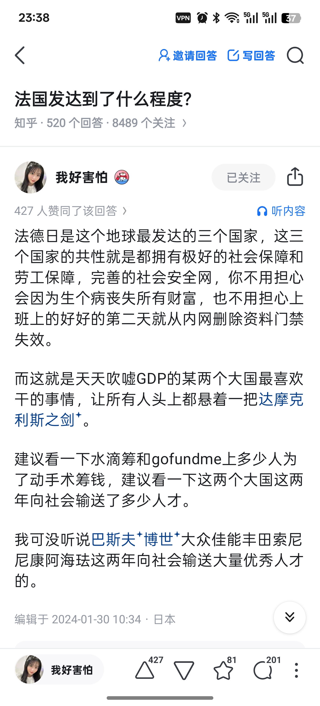

# 进步的暴力

## 起源
思考的起源在什么时候，可能已经很久远了。来自很久以前的不甘心。说起起源，不如当成导火索吧，知乎喷总的一个想法激起了我的很多思考。

* >全球化是经济分工，经济分工带来发展与进步，越快的进步越容易带来落后群体，落后群体认为自己的落后不是自己的问题而是进步本身带来的，所以反对进步。
* >类似的还有乌克兰和荷兰的农民反对工业化一样(如果他们能出声)，是非常天然的。这也是为啥民主政体很难独立跨越式发展，因为总会被落后群体拉住。
* >这也是我为什么说民主党其实是真的心善。东亚大群基本操作水平下美国OD死亡数*和人均芬太尼消费量都得再涨一个数量级。
* > From 喷喷更健康（真知棒）

起初看到这句话的时候，我心里很不适，感觉这话啊，真是上位者对普通人的冷冰冰的审判，但说实话，这话最精妙的还是第一段，进步带来了落后，落后是进步的问题而不是自己的问题。

有句话有异曲同工之妙，在深圳进步太慢也是一种退步。以前看到这句话的时候多少感觉有些幽默，似乎在嘲讽卷批，嘲笑深圳。但是，随着AI时代的到来，可笑变成了可悲，淡淡的绝望。

## 对比--日本知乎网友

知乎上面有一个美国留学最后回日本工作的网友，总之，他喜欢躺平，喜欢摸鱼闲适的工作，喜欢不用动脑子，聊聊天，糊弄式的工作。他的一个常见的偏激观点就是，美国和中国都是卷批国家，是人类世界的毒瘤。进步的太快了，天天淘汰其他人，其他国家，这是toxic的。

这位博主叫做***我好害怕***,输出了相当多的抨击中国和美国的内容

观点很多，反正就是抨击社会达尔文主义。一般来说，卷批的行为很多时候和进步挺像的，或者说，卷批更爱进步，学习，只不过他们的自驱力来自于要做人上人，要过的更好。而不是自己内心发自喜爱。硅谷，这个博主认为的人类文明谷地，我觉得就是一大批卷批加上少数的梦想家组成的。当然这只是我的一家之言。

## 我的思考 智能手机 5G 元宇宙 AI
社会是在进步的，作为00年生人。我来缓缓阐述一下我眼中的世界变迁吧。

### 智能手机
IPhone的浪潮是在我小学的时候就掀起了，也就是2012年之前。但是，那个时候给我的印象平平，有一个很关键的因素，流量费用。智能手机真正的普及源于4G,我印象已经有些模糊了，只记得似乎是某一个三星手机率先支持了4G，再后来4G手机就源源不断的出现了，一个手机没有4G，说实话，就和我家不能连网的电脑一样，幽默极了。（我爸妈为了面子买了电脑，但又不联网，纯纯的安卓思维，当然，我也不清楚，如果电脑可以联网，我如今会过得怎么样，难以想象啊）。言归正传，4G让以前100MB就要好几十的流量包一下子进入了GB时代，直播，移动端手游，微信，这些我们深爱的或者已经离不开的东西，爆发了。

真的，好像就在一夜之间，智能手机普及了，qq，微信普及了。比我小三岁的同事至今还可以联系到他的小学同学，而我，也只是加过我初中同学的qq群，小学同学更是难以联系上。一切的一切，恐怕就是晚生三年的他，在更年轻的时候，就被这股智能手机浪潮普及到了。老的，少的，穷的，富的，好快，就一下子，许多人尚未接触过电脑，就迈入了智能时代。迈入吗？他们似乎没得选。

### 5G
5G在许多人眼中是一个幽默的词汇。让我感觉最幽默的就是4G+鸿蒙>5G。言归正传，华子刚整出5G的时候，还是风头无量的，全中国都在推5G,美国也在制裁华为，许多人宣扬，中国的5G科技大于美国至少一年，一年，可以抢占无数的商业地盘，诞生无数的新型产业，至少，当时是这样吹的。但是，不难看出来，当一项可能革命性的新技术出现的时候，国家之间，会撕下脉脉温情的脸面，相互折腾攻击，幽默的是，国家之间似乎指中美之间，诸多国家只是看着，似乎也是没得选哦。

### 元宇宙
这个是纯纯小丑，扎克伯格搞的抽象玩意，但估计vision pro也是听了小札的吹水搞得，总之，即使是这样一个莫名其妙，生搬硬凑的概念，几个公司都要都上一斗，扯上一扯。

### AI
这是真正的重头戏，我不知道未来会怎么样。我坦然接受，能做到吗？不甘心啊。回想起我的生活，我似乎可以自由的选择，自由的行动，但是时代的发展让你不得不用智能手机，不得不用微信，不得不用小程序点餐，不得不去任何一家餐厅都要SM美团，点评。当然，AI的到来，会让你在做任何智力工作的时候都不能不用，不得不参考，不然，你真的会被淘汰，当然，如果你的工作已经可以被替换以原来0.01%的成本产出劣质或者类似的内容时，你已经被淘汰了。美术，建模，视频创作，当然，我们写代码的估计也没几年好日子过喽。

从头说来，我的舍友是做LLM，但是在2022年刚入学的时候，没有LLM,他说他是做NLP的。哈哈，当时西湖很美，还下着雪，是疫情的尾声。我选修了计算机视觉的课，里面有一个Eigen Face，如今看来算是古法AI了，还有SIFT算子，总之要实现一下，使用python。我不会python，但是GPT3.5出来了，我也懒得学，拍了好几个照片，就用gpt帮我写作业。写的依托，sift的不同图片链接对比是ok的，但是eigenface识别做的一坨。我反复问了他一个下午加晚上，他依然没有解决。当时，我觉得LLM就像一个究极大的，依靠直觉的怪物，没有思考能力。

O1的出现，告诉我错了。我错了，思考快与慢中告诉我，人依靠系统1和系统2做判断，LLM他都有，更好的直觉，更加缜密的系统2，时代还在飞速发展，claude code,gpt5，gemini,sora,好多好多。

进步撕去了脉脉温情的面纱，背后的不是怪兽，而是冷冰冰前进的机器，机器上是热血沸腾的，渴望改变世界的人们，我从他们身上，看到了激情，梦想，欲望，还有暴力。

现代化的进步是一种伪装起来的暴力，他以替人好的形式出现，因为他的benifit够大，你不得不用，大家都用，不用就淘汰。想想吧，不用智能手机微信的人，怎么在疫情期间出现，扫码，怎么去饭桌点菜。你如果不用，你就没有自由。很快，AI也会扮演这样的角色，他已经在扮演了。

当然，在我的眼中，这里面是有一种幽默的感觉的，因为AI与其他进步不一样，他，可能会淘汰人类这种形态，当然，这是后话了。

## 熊彼特--创造性毁灭

## Note
* 写不动了，写到11_13了。下次再认真写完喽。